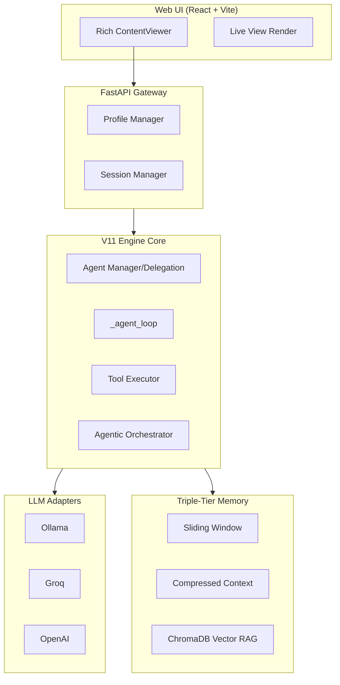

# shovs (V11 Mother Platform)

A high-performance, local-first, hybrid-cloud **General-Purpose AI Agent Orchestrator** designed for autonomous Deep Research, persistent Semantic Memory, Document Analysis, and isolated Code Execution.


## 🚀 The "V11 Mother Platform" Philosophy

This platform is built like a high-performance engine. It prioritizes **low-latency inference**, **parallel tool execution**, and **hierarchical semantic isolation**. Unlike monolithic frameworks, Agent Platform uses a modular adapter architecture that allows you to swap intelligence providers mid-conversation without losing state or memory consistency.

## ✨ Key Features

- **Agentic Orchestrator (Planners)**: Employs a smaller, faster model to pre-compute structural `<plan>` blocks detailing strategies prior to main LLM execution, significantly reducing hallucination across complex research tasks.
- **Hierarchical Agent Delegation**: A robust `AgentManager` allows a parent "Mother Agent" to dynamically securely spin up isolated child agents (e.g., a pure 'researcher', 'writer', or 'coder') with restricted toolsets to solve deep subtasks.
- **Hybrid Intelligence**: Toggle between local **Ollama** models and cloud-based **Groq**/**Anthropic** APIs mid-chat using dynamic Adapter propagation.
- **Multi-Tool Concurrent Execution**: The agent can plan and fire multiple tools (SearXNG Web Search, Trafilatura Fetch, PDF parsing, Bash execution) simultaneously in a single turn.
- **Deep Semantic Memory Graph**: Beyond simple Vector RAG, the system extracts Subject-Predicate-Object triplets into a SQLite/Vector hybrid Knowledge Graph to map relational connections across long-term interactions.
- **Live View Rendering**: Real-time rendering of HTML and SVG code blocks with interactive previews.

## 🏗️ Architecture



## 🛠️ Quick Start

### 1. Prerequisites

- [Ollama](https://ollama.ai/) (for local inference)
- [Docker](https://www.docker.com/) (for SearxNG search backend)
- Python 3.10+

### 2. Setup

```bash
# Clone the repository
git clone https://github.com/theshovonsaha/shovsai.git
cd shovsai

# Install dependencies
pip install -r requirements.txt
npm install

# Setup environment
cp .env.example .env
```

### 3. Run with Docker (Recommended)

```bash
docker-compose up -d
```

### 4. Run Manually (recommended for development)

From the project root run the single development command which starts both backend and frontend:

```bash
# From project root
npm run dev
```

If you prefer to start components separately you can still run the backend directly:

```bash
# Start backend only
python -m api.main
```

## 🔧 Universal Tool Arsenal

- **Dynamic Web Search**: Multi-backend fallback chain using SearXNG, Tavily, Brave, and DuckDuckGo HTML scraping.
- **Deep Content Extraction**: Full-page readable content extraction via `httpx` and custom HTML parsing (`Trafilatura`/`BeautifulSoup` style logic).
- **Document Processing**: Read, split, merge, and generate PDF reports automatically.
- **Semantic Memory Graph**: Persistent long-term factual triplet storage across sessions.
- **Bash Shell**: Safe, sandboxed script and command execution for code-related tasks.
- **File System**: Create, view, and modify files with contextual diff support.

## 📜 License

MIT License. See [LICENSE](LICENSE) for details.
