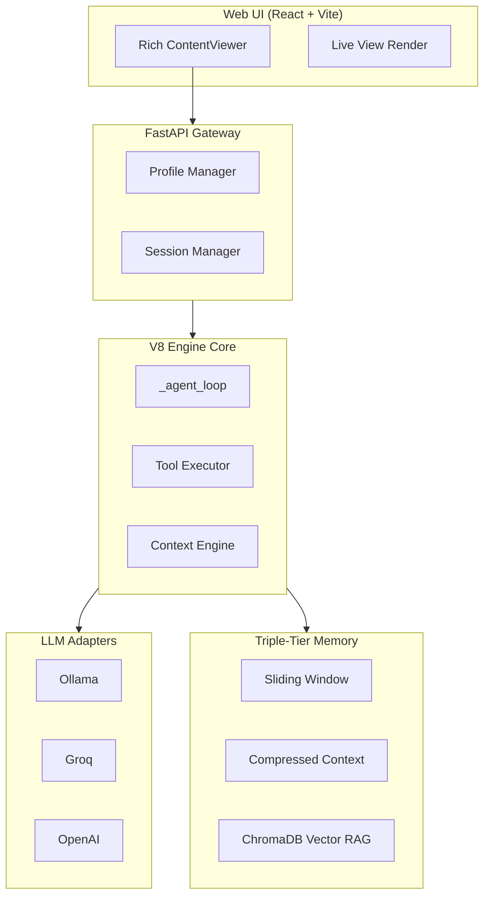

# Agent Platform v0.6.0 (V8 Engine)

A high-performance, local-first, hybrid-cloud AI Agent Orchestrator designed for speed, flexibility, and deep semantic memory.


## 🚀 The "V8 Engine" Philosophy
This platform is built like a high-performance engine. It prioritizes **low-latency inference**, **parallel tool execution**, and **semantic isolation**. Unlike monolithic frameworks, Agent Platform uses a modular adapter architecture that allows you to swap intelligence providers mid-conversation without losing state or memory consistency.

## ✨ Key Features

- **Hybrid Intelligence**: Toggle between local **Ollama** models and cloud-based **Groq** APIs mid-chat. Intelligent routing detects model capabilities automatically.
- **Persistent Pinned Embeddings**: Embedding models are fixed at the Agent level. Your memory vector space stays consistent for life, even if you switch your main LLM from Llama to GPT.
- **Multi-Tool Concurrent Execution**: The agent can plan and fire multiple tools (Web Search, Bash, File Ops) simultaneously in a single turn.
- **Deep Semantic Memory**: Beyond simple RAG, it uses a hybrid Vector Knowledge Graph to map relational connections between facts.
- **Live View Rendering**: Real-time rendering of HTML and SVG code blocks with interactive previews.

## 🏗️ Architecture



## 🛠️ Quick Start

### 1. Prerequisites
- [Ollama](https://ollama.ai/) (for local inference)
- [Docker](https://www.docker.com/) (for SearxNG search backend)
- Python 3.10+

### 2. Setup
```bash
# Clone the repository
git clone https://github.com/your-repo/agent-platform.git
cd agent-platform

# Install dependencies
pip install -r requirements.txt
cd frontend && npm install && cd ..

# Setup environment
cp .env.example .env
```

### 3. Run with Docker (Recommended)
```bash
docker-compose up -d
```

### 4. Run Manually
```bash
# Start Backend
python -m api.main

# Start Frontend
cd frontend && npm run dev
```

## 🔧 Tools Included
- **Web Search**: Multi-backend support via SearxNG.
- **Bash Shell**: Safe, sandboxed command execution.
- **File System**: Create, view, and modify files with diff support.
- **Semantic Memory**: Persistent long-term fact storage.

## 📜 License
MIT License. See [LICENSE](LICENSE) for details.
