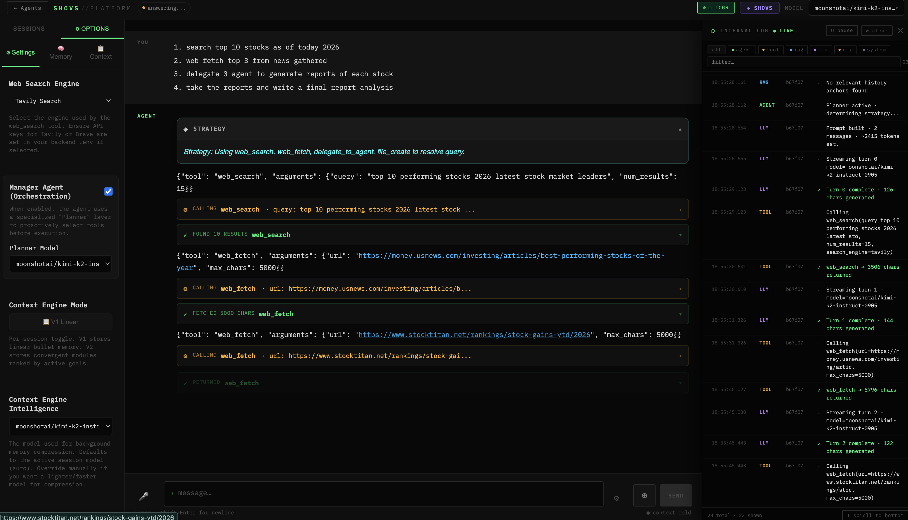
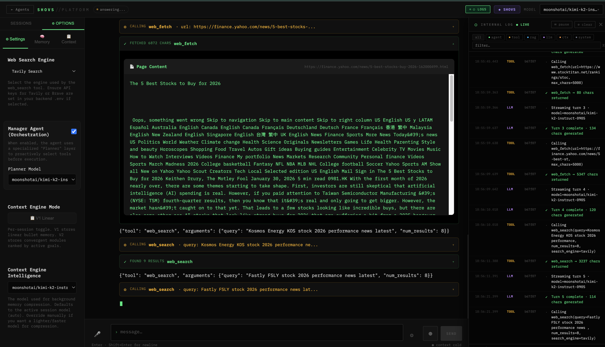
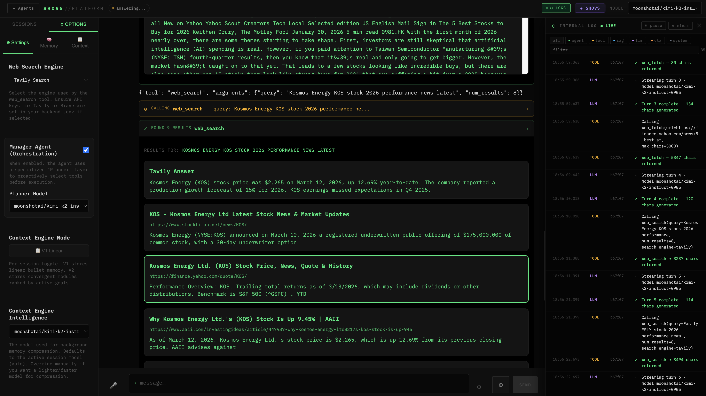
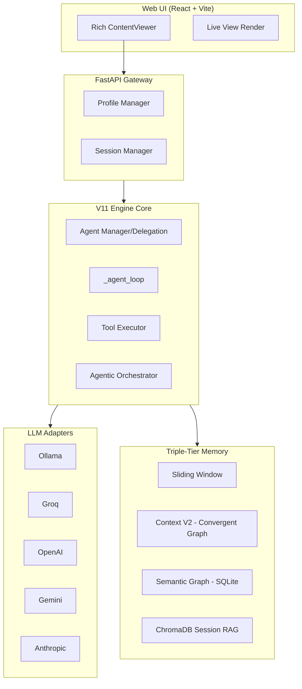
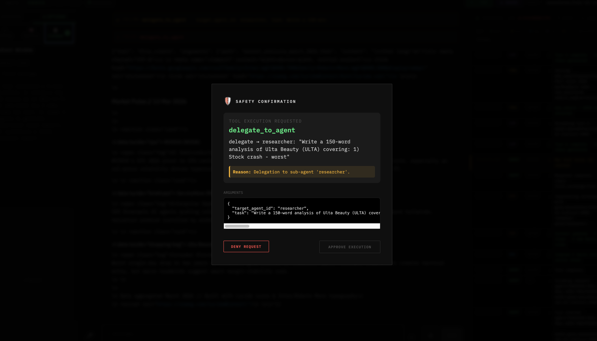
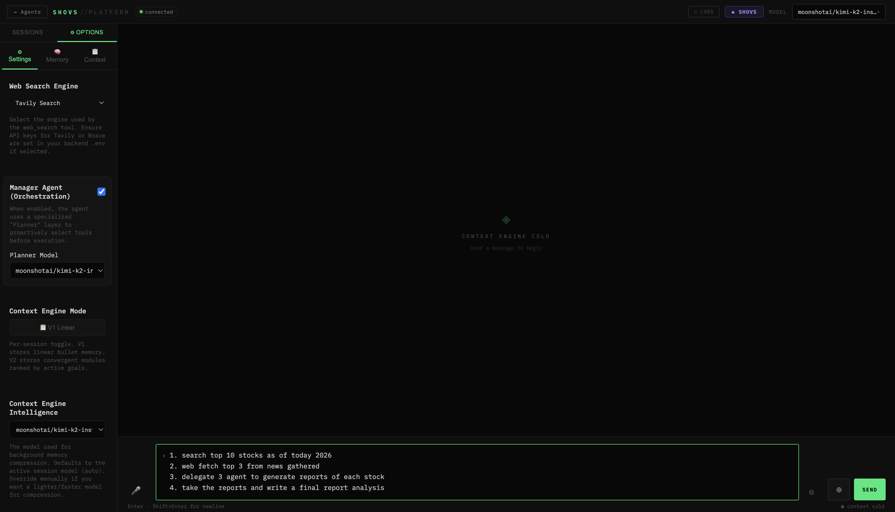

# shovs (V11 Mother Platform)

A high-performance, local-first, hybrid-cloud **General-Purpose AI Agent Orchestrator** designed for autonomous Deep Research, persistent Semantic Memory, Document Analysis, and isolated Code Execution.


## 🚀 The "V11 Mother Platform" Philosophy

This platform is built like a high-performance engine. It prioritizes **low-latency inference**, **parallel tool execution**, and **hierarchical semantic isolation**. Unlike monolithic frameworks, Agent Platform uses a modular adapter architecture that allows you to swap intelligence providers mid-conversation without losing state or memory consistency.

## ✨ Key Features

- **Agentic Orchestrator (Planners)**: Employs a smaller, faster model to pre-compute structural `<plan>` blocks detailing strategies prior to main LLM execution, significantly reducing hallucination across complex research tasks.
- **Hierarchical Agent Delegation**: A robust `AgentManager` allows a parent "Mother Agent" to dynamically securely spin up isolated child agents (e.g., a pure 'researcher', 'writer', or 'coder') with restricted toolsets to solve deep subtasks.
- **Hybrid Intelligence**: Toggle between local **Ollama** models and cloud-based **Groq**/**Anthropic** APIs mid-chat using dynamic Adapter propagation.
- **Multi-Tool Concurrent Execution**: The agent can plan and fire multiple tools (SearXNG Web Search, Trafilatura Fetch, PDF parsing, Bash execution) simultaneously in a single turn.
- **Deep Semantic Memory Graph**: Beyond simple Vector RAG, the system extracts Subject-Predicate-Object triplets into a SQLite/Vector hybrid Knowledge Graph to map relational connections across long-term interactions.
- **Live View Rendering**: Real-time rendering of HTML and SVG code blocks with interactive previews.

### 📸 Product Tour


*Figure 1: Autonomous planning and multi-tool execution in the V11 core.*

<p align="center">
  
  
</p>
*Figure 2: Real-time web fetching and multi-provider search results.*

## 🏗️ Architecture



## 🛠️ Quick Start

### 1. Prerequisites

Before starting, ensure you have the following installed:

| Component   | Version | Purpose                                                 | Install                                                      |
| ----------- | ------- | ------------------------------------------------------- | ------------------------------------------------------------ |
| **Python**  | 3.10+   | Backend runtime                                         | [python.org](https://www.python.org/downloads/)              |
| **Node.js** | 18+     | Frontend build & dev server                             | [nodejs.org](https://nodejs.org/)                            |
| **Docker**  | Latest  | SearXNG search backend (optional for production)        | [docker.com](https://www.docker.com/products/docker-desktop) |
| **Ollama**  | Latest  | Local LLM inference (optional, use cloud API otherwise) | [ollama.ai](https://ollama.ai/)                              |

**Node.js Version Check:**

```bash
node --version  # should be v18.0.0 or higher
npm --version   # should be 9.0.0 or higher
```

**Python Version Check:**

```bash
python3 --version  # should be 3.10 or higher
pip3 --version
```

### 2. Setup

```bash
# Clone the repository
git clone https://github.com/theshovonsaha/shovsai.git
cd shovsai

# Install dependencies
pip install -r requirements.txt
npm install

# Setup environment
cp .env.example .env
```

> **Note:** The `mcp-hub` package listed in comments is a custom local module and is not available on PyPI. If you're integrating MCP (Model Context Protocol) features, install `mcp` separately or add your custom `mcp-hub` to the local project.

### 3. Service Architecture & Why You Need Each

Before running the app, understand what each service does:

#### **Backend (FastAPI + Uvicorn) — `http://localhost:8000`**

- **What it does:** Core AI agent orchestration, session management, tool execution, RAG (semantic search), voice processing.
- **Why you need it:** Handles all business logic, chat comprehension, memory, and tool orchestration.
- **Key components:**
  - **AgentCore**: Main reasoning engine with multi-turn conversation tracking.
  - **SessionManager**: Persistent session storage (SQLite) and context windows.
  - **ChromaDB**: Vector database for semantic memory (RAG) across documents.
  - **ToolRegistry**: Callable tools like web search, file I/O, bash execution.
  - **LLM Adapters**: Swap between Ollama (local), Groq, OpenAI, Anthropic mid-chat.
- **Port:** `8000`
- **Language:** Python (FastAPI)

#### **Frontend (React + Vite) — `http://localhost:5173`**

- **What it does:** Rich web UI for chat, agent profiles, live HTML/SVG rendering, session history.
- **Why you need it:** User-facing interface with markdown rendering, syntax highlighting, LaTeX math support, and live code previews.
- **Key features:**
  - Real-time chat streaming.
  - Agent profile selection and creation.
  - Session persistence and management.
  - Live code/HTML/SVG rendering in the UI.
  - Accessibility and responsive design.
- **Port:** `5173`
- **Language:** React 19 + TypeScript + Vite

#### **SearXNG (Search Engine) — `http://localhost:8080`**

- **What it does:** Privacy-respecting meta-search aggregating DuckDuckGo, Google, Bing, and other engines.
- **Why you need it:** Enables the backend to perform real-time web searches without external API keys.
- **Configuration:** Lives in `./searxng/` directory (settings.yml, etc.).
- **Port:** `8080`
- **Docker Image:** `searxng/searxng:latest`

#### **Ollama (Local LLM) — `http://localhost:11434`** _(optional)_

- **What it does:** Runs open-source LLMs (llama3.2, mistral, etc.) locally without cloud API costs.
- **Why you need it:** Enables private, low-latency inference on your machine.
- **When to skip:** If you set `GROQ_API_KEY` or `OPENAI_API_KEY` instead.
- **Models:** Pull any model via `ollama pull llama3.2` (used by default).
- **Port:** `11434`

#### **Cloud LLM Providers** _(optional, but recommended)_

- **Groq:** Fast cloud inference (free tier available). Set `GROQ_API_KEY`.
- **OpenAI:** GPT-4 and GPT-3.5. Set `OPENAI_API_KEY`.
- **Anthropic:** Claude models. Set `ANTHROPIC_API_KEY`.
- **Google Gemini:** Multimodal reasoning. Set `GEMINI_API_KEY`.

**Choose One of:**

- Local: `OLLAMA_BASE_URL=http://localhost:11434` + `ollama pull llama3.2` + run `ollama serve`
- Cloud: `GROQ_API_KEY=gsk_...` or `OPENAI_API_KEY=sk-...`

### 4. Environment Variables Setup

Copy `.env.example` to `.env` and configure the following:

```bash
cp .env.example .env
```

**Essential Variables:**

```bash
# ─── LLM Provider (choose one) ───────────────────────────────
# Option 1: Local Ollama
OLLAMA_BASE_URL=http://localhost:11434
DEFAULT_MODEL=llama3.2

# Option 2: Cloud Groq (fast + free tier)
GROQ_API_KEY=gsk_YOUR_KEY_HERE

# Option 3: OpenAI
OPENAI_API_KEY=sk-YOUR_KEY_HERE

# ─── Search Engine ──────────────────────────────────────────
# Local (recommended for privacy): Will use Docker SearXNG
SEARXNG_BASE_URL=http://localhost:8080

# Cloud options (set API keys if not using local SearXNG)
# TAVILY_API_KEY=tvly_YOUR_KEY_HERE
# BRAVE_SEARCH_KEY=YOUR_KEY_HERE

# ─── Optional Cloud Providers ───────────────────────────────
# ANTHROPIC_API_KEY=sk-ant-...
# GEMINI_API_KEY=AIza...
# DEEPGRAM_API_KEY=...  # Voice
```

**Server Config:**

```bash
# FastAPI server
HOST=0.0.0.0       # Bind to all interfaces (safe in Docker, restrict in production)
PORT=8000          # Backend port
DEBUG=True         # Set to False in production

# Frontend will auto-resolve to http://localhost:8000
```

**Memory & Database:**

```bash
# Persistent storage (created in project root)
SESSIONS_DB=sessions.db       # Session history
AGENTS_DB=agents.db           # Agent profiles
CHROMA_DB_PATH=./chroma_db    # Vector embeddings (RAG)
EMBED_MODEL=nomic-embed-text  # For semantic search
```

**Advanced:**

```bash
# Agent behavior
MAX_TOOL_TURNS=6              # Max tool calls per turn (AgentCore default)
DEFAULT_MODEL=llama3.2        # Fallback model
SLIDING_WINDOW_SIZE=20        # Context window size (msgs)

# Bash safety (for code execution)
BASH_TIMEOUT=30               # Max seconds for bash commands
SANDBOX_DIR=./agent_sandbox   # Isolated execution directory

# Voice (optional)
WHISPER_MODEL=base            # Speech-to-text model
TTS_ENGINE=auto               # Text-to-speech (auto|kokoro|edge-tts|piper)
```

**Example .env for Quick Start:**

```bash
# Use Groq (free, fast)
GROQ_API_KEY=gsk_paste_your_groq_key_here
SEARXNG_BASE_URL=http://localhost:8080
PORT=8000
HOST=0.0.0.0
DEBUG=True
```

or

```bash
# Use Local Ollama
OLLAMA_BASE_URL=http://localhost:11434
DEFAULT_MODEL=llama3.2
SEARXNG_BASE_URL=http://localhost:8080
PORT=8000
HOST=0.0.0.0
DEBUG=True
```

### 5. Run Natively (Recommended for Development)

From the project root, start both backend and frontend services with a single command:

```bash
npm run dev
```

This runs:

1. `npm run dev:services` — Starts SearXNG via Docker (`docker compose up -d searxng`)
2. `npm run dev:backend` — FastAPI server on port 8000 (with hot reload)
3. `npm run dev:frontend` — Vite dev server on port 5173 (with hot reload)

All three run concurrently. You'll see logs from all services in your terminal.

**Access the app:**

- Frontend: http://localhost:5173
- Backend API: http://localhost:8000/docs (Swagger interactive docs)
- Search: http://localhost:8080 (SearXNG)

**To stop:** Press `Ctrl+C` to stop the concurrent processes and then run:

```bash
docker compose down  # stops searxng container
```

**Alternatively, start services individually in separate terminals:**

```bash
# Terminal 1: Backend only (FastAPI on port 8000)
python -m api.main

# Terminal 2: Frontend only (Vite dev server on port 5173)
cd frontend && npm run dev

# Terminal 3: Start SearXNG (optional but recommended)
docker compose up -d searxng
```

Note: `npm run dev` automatically starts SearXNG, so you only need the backend and frontend if running them separately.

### 6. Run with Docker

This project includes both production and development Docker setups:

#### Development with Docker (recommended for contributors)

Use the development compose override which mounts your source code and runs hot-reload dev servers inside containers. This preserves the local `npm run dev` workflow and does not build images:

```bash
docker compose -f docker-compose.dev.yml up -d
```

The `docker-compose.dev.yml` automatically:

- Starts `searxng`, `backend`, and `frontend` services.
- Mounts source code with hot reload enabled.
- Streams logs to your terminal.
- Exposes ports: `5173` (frontend), `8000` (backend), `8080` (searxng).

Stop with:

```bash
docker compose -f docker-compose.dev.yml down
```

#### Production Build

The stock `docker-compose.yml` builds production images using `Dockerfile`s included in the repo:

```bash
docker compose up -d
```

This runs optimized, containerized versions of all services. Best for deployments or CI/CD workflows.

Stop with:

```bash
docker compose down
```

### 6. Run with Docker

This project includes both production and development Docker setups:

#### Development with Docker (recommended for contributors)

Use the development compose override which mounts your source code and runs hot-reload dev servers inside containers. This preserves the local `npm run dev` workflow and does not build images:

```bash
docker compose -f docker-compose.dev.yml up -d
```

The `docker-compose.dev.yml` automatically:

- Starts `searxng`, `backend`, and `frontend` services.
- Mounts source code with hot reload enabled.
- Streams logs to your terminal.
- Exposes ports: `5173` (frontend), `8000` (backend), `8080` (searxng).

Stop with:

```bash
docker compose -f docker-compose.dev.yml down
```

#### Production Build

The stock `docker-compose.yml` builds production images using `Dockerfile`s included in the repo:

```bash
docker compose up -d
```

This runs optimized, containerized versions of all services. Best for deployments or CI/CD workflows.

Stop with:

```bash
docker compose down
```

### 7. Architecture Overview

```
┌─────────────────────────────────────────────────────┐
│                Frontend (React + Vite)              │
│      http://localhost:5173 (dev) or via nginx      │
└────────────────────┬────────────────────────────────┘
                     │
┌────────────────────▼────────────────────────────────┐
│          Backend (FastAPI + Uvicorn)                │
│      http://localhost:8000 /api/chat, /api/logs    │
└────────────────────┬────────────────────────────────┘
                     │
        ┌────────────┼────────────┐
        ▼            ▼            ▼
    [Ollama]   [Groq API]  [SearXNG]
   Local LLM   Cloud LLM    Web Search
```

**Persistence:** Agent logs, session data, and vector embeddings are stored in SQLite databases and ChromaDB (all in the project directory by default).

### 8. Troubleshooting

**Port already in use:**

```bash
# Find what's using port 8000
lsof -i :8000

# Find what's using port 5173
lsof -i :5173

# Kill by PID
kill -9 <PID>
```

**Docker SearXNG not starting:**

```bash
# Check Docker status
docker compose ps

# View logs
docker compose logs searxng

# Manual restart
docker compose down && docker compose up -d searxng
```

**Python dependencies fail:**

```bash
# Ensure venv is activated
source venv/bin/activate  # macOS/Linux
# or
venv\Scripts\activate  # Windows

# Try upgrading pip
pip install --upgrade pip

# Re-install requirements
pip install -r requirements.txt --force-reinstall
```

**Frontend build warning (large chunks):**
This warning is safe to ignore. It's just a notice that some JavaScript bundles are large (normal for complex UIs with markdown/KaTeX support).

## 🔧 Universal Tool Arsenal

- **Dynamic Web Search**: Multi-backend fallback chain using SearXNG, Tavily, Brave, and DuckDuckGo HTML scraping.
- **Deep Content Extraction**: Full-page readable content extraction via `httpx` and custom HTML parsing (`Trafilatura`/`BeautifulSoup` style logic).
- **Document Processing**: Read, split, merge, and generate PDF reports automatically.
- **Semantic Memory Graph**: Persistent long-term factual triplet storage across sessions.
- **Bash Shell**: Safe, sandboxed script and command execution for code-related tasks.
- **File System**: Create, view, and modify files with contextual diff support.

### 🛡️ Safety & Configuration


*Figure 3: Built-in safety guardrails requiring manual confirmation for sensitive tool calls.*


*Figure 4: Granular control over agent profiles, search engines, and context modes.*

## 📜 License

MIT License. See [LICENSE](LICENSE) for details.
