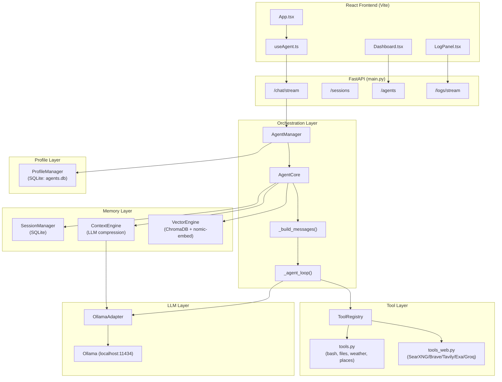
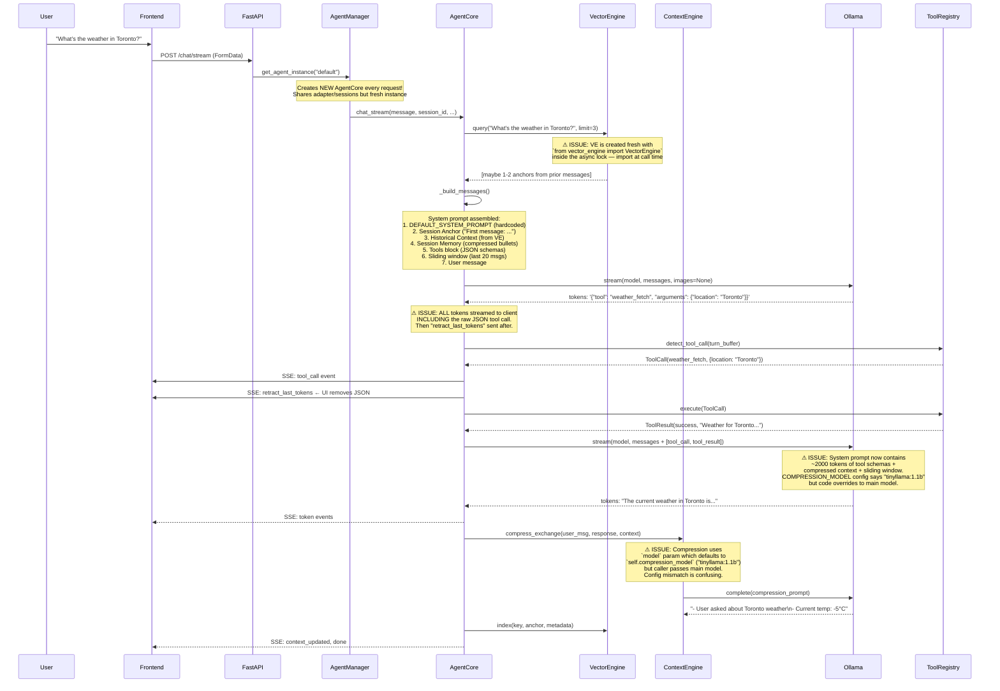

# Agent Platform — Deep Architecture Analysis

## 1. What You Built (Intent Decoded)

Your codebase reveals a **local-first, multi-agent orchestration platform** with these core ideas:

1. **Everything is a messages array** — the entire intelligence of the system lives in how the `messages[]` prompt is assembled each turn
2. **Two-tier memory** — sliding window (raw recent) + compressed context (LLM-summarized bullets) + vector RAG (keyed facts from ChromaDB)
3. **Text-mode tool calling** — instead of using native LLM tool APIs, you parse JSON from the model's text output (brace-counting scanner)
4. **Multi-agent isolation** — agent profiles with scoped tool registries and isolated sessions/vector stores
5. **Observable internals** — SSE log stream with categorical filtering (agent/tool/rag/llm/ctx) for debugging the black box
6. **Multi-backend search** — SearXNG/Brave/Tavily/Exa/Groq fallback chain with auto-selection

> **Your vision:** A modular agent OS where memory, tools, and LLM are swappable layers, with the prompt as the "kernel" — and eventually voice as another I/O channel.

---

## 2. Architecture Diagram



## 3. Prompt Dry Run — Current vs. Fixed

### 🎯 Scenario: User sends "What's the weather in Toronto?" (2nd message in session)

---

### CURRENT SYSTEM — What actually happens:



### PROBLEMS IN CURRENT FLOW:

| # | Issue | Severity | Location |
|---|-------|----------|----------|
| 1 | **Agent profile system_prompt ignored** — [AgentCore](file:///Users/theshovonsaha/Developer/Github/agent/core.py#35-292) uses hardcoded `DEFAULT_SYSTEM_PROMPT`, profile's `system_prompt` only used if passed via [ChatRequest](file:///Users/theshovonsaha/Developer/Github/agent/main.py#59-65) | 🔴 Critical | `core.py:63`, `agent_manager.py:54-59` |
| 2 | **Tool call JSON flashes in UI** — all tokens streamed including raw JSON, then retracted. Causes visual glitch. | 🟡 Medium | `core.py:182-184` |
| 3 | **VectorEngine imported inside async lock** — `from vector_engine import VectorEngine` at line 81 of [core.py](file:///Users/theshovonsaha/Developer/Github/agent/core.py) runs on every request | 🟡 Medium | `core.py:81` |
| 4 | **Compression model config mismatch** — `COMPRESSION_MODEL = "tinyllama:1.1b"` in [main.py](file:///Users/theshovonsaha/Developer/Github/agent/main.py) but `ContextEngine.__init__` defaults to `"llama3.2"`. The caller (core.py:143) passes the main model anyway, making the config dead code | 🟡 Medium | `main.py:33`, `context_engine.py:78` |
| 5 | **Missing `_verify_citations()` method** — test expects it in [AgentCore](file:///Users/theshovonsaha/Developer/Github/agent/core.py#35-292) but it doesn't exist | 🔴 Critical | `test_hallucination_guards.py:70` |
| 6 | **Test expects wrong pivot message** — test checks for `[SOLVABILITY GUARD: HARD PIVOT]` but code emits `[SYSTEM: Tool '...' failed 3 times...]` | 🔴 Critical | `test_hallucination_guards.py:52` vs `core.py:227` |
| 7 | **No `system_prompt` passed from AgentManager** — `AgentManager.get_agent_instance()` creates [AgentCore](file:///Users/theshovonsaha/Developer/Github/agent/core.py#35-292) but never passes the profile's `system_prompt`. The profile prompt is completely ignored. | 🔴 Critical | `agent_manager.py:54-60` |
| 8 | **Duplicate tool registration** — [tools.py](file:///Users/theshovonsaha/Developer/Github/agent/tools.py) and [tools_web.py](file:///Users/theshovonsaha/Developer/Github/agent/tools_web.py) both define [web_search](file:///Users/theshovonsaha/Developer/Github/agent/tools_web.py#394-480) and [web_fetch](file:///Users/theshovonsaha/Developer/Github/agent/tools_web.py#554-636). [register_web_tools()](file:///Users/theshovonsaha/Developer/Github/agent/tools_web.py#676-685) overrides [register_all_tools()](file:///Users/theshovonsaha/Developer/Github/agent/tools.py#909-914) — this works but is fragile | 🟡 Medium | `main.py:38-39` |
| 9 | **ChromaDB collection per session** — creates `agent_{id}_session_{sid}` collections. With 200 max sessions, this creates up to 200 ChromaDB collections. No cleanup. | 🟡 Medium | `vector_engine.py:22` |
| 10 | **`pydantic` requirement missing in [requirements.txt](file:///Users/theshovonsaha/Developer/Github/agent/requirements.txt)** — FastAPI v2 may have it bundled, but it should be explicit | 🟢 Low | [requirements.txt](file:///Users/theshovonsaha/Developer/Github/agent/requirements.txt) |
| 11 | **`chromadb` missing from [requirements.txt](file:///Users/theshovonsaha/Developer/Github/agent/requirements.txt)** | 🔴 Critical | [requirements.txt](file:///Users/theshovonsaha/Developer/Github/agent/requirements.txt) |

---

### FIXED SYSTEM — What it should look like:

```diff
# agent_manager.py — Pass profile system_prompt to AgentCore
  return AgentCore(
      adapter=self.adapter,
      context_engine=self.ctx_eng,
      session_manager=self.sessions,
      tool_registry=filtered_registry,
-     default_model=config.model
+     default_model=config.model,
+     default_system_prompt=config.system_prompt,
  )
```

```diff
# core.py — Use instance-level system prompt
  class AgentCore:
      def __init__(self, ...,
+         default_system_prompt: str = DEFAULT_SYSTEM_PROMPT,
      ):
+         self.def_system_prompt = default_system_prompt

  async def chat_stream(self, ...):
-     system_prompt = system_prompt or DEFAULT_SYSTEM_PROMPT
+     system_prompt = system_prompt or self.def_system_prompt
```

```diff
# core.py — Move import to top level
- # Inside chat_stream:
-     from vector_engine import VectorEngine
+ # At top of file:
+ from vector_engine import VectorEngine
```

```diff
# requirements.txt — Add missing deps
+ chromadb
+ pydantic
```

---

## 4. What's Broken vs. What's Solid

### ✅ Solid (Don't Touch)
- **ToolRegistry brace-counting scanner** — correctly handles nested JSON, multiple candidates
- **SSE streaming architecture** — clean event protocol, client handles all event types
- **Session persistence** — SQLite + in-memory cache with LRU eviction
- **File processor** — clean separation of image/PDF/text handling
- **Logger + LogPanel** — excellent debugging infrastructure
- **Multi-backend search** — well-engineered fallback chain with error categorization
- **Frontend hook ([useAgent.ts](file:///Users/theshovonsaha/Developer/Github/agent/frontend/src/useAgent.ts))** — clean state management, SSE parsing, retraction logic

### 🔴 Broken (Must Fix)
1. **Agent profile `system_prompt` is dead** — never reaches the LLM
2. **Tests don't pass** — `_verify_citations` doesn't exist, pivot message format mismatch
3. **`chromadb` not in requirements** — fresh install fails
4. **Compression model confusion** — dead config, model param threading is inconsistent

### 🟡 Fragile (Should Fix)
5. **Tool call visual glitch** — JSON flashes then retracts, looks broken
6. **No graceful Ollama error** — if Ollama is down, user gets opaque httpx error
7. **No agent profile update endpoint** — can create and delete but not update
8. **ChromaDB collections accumulate** — no garbage collection

---

## 5. The Quick True Path Forward

### Phase 0: Make It Actually Work (1 session)
> Fix the 4 critical bugs so basic chat works end-to-end

1. Wire agent profile `system_prompt` through [AgentManager](file:///Users/theshovonsaha/Developer/Github/agent/agent_manager.py#15-61) → [AgentCore](file:///Users/theshovonsaha/Developer/Github/agent/core.py#35-292)
2. Add `chromadb` + `pydantic` to [requirements.txt](file:///Users/theshovonsaha/Developer/Github/agent/requirements.txt)
3. Move [VectorEngine](file:///Users/theshovonsaha/Developer/Github/agent/vector_engine.py#11-78) import to top of [core.py](file:///Users/theshovonsaha/Developer/Github/agent/core.py)
4. Fix tests: implement `_verify_citations()`, fix pivot message assertion
5. Remove `COMPRESSION_MODEL` dead config from [main.py](file:///Users/theshovonsaha/Developer/Github/agent/main.py) (it's misleading)

### Phase 1: Modular Foundation (2-3 sessions)
> Refactor for clean module boundaries

1. **Extract prompt builder** — [_build_messages()](file:///Users/theshovonsaha/Developer/Github/agent/core.py#244-292) → `prompt_builder.py` with a `PromptBuilder` class. This is your kernel — treat it with respect
2. **Config file** — Replace scattered constants with a `config.py` or `config.yaml` loading from [.env](file:///Users/theshovonsaha/Developer/Github/agent/.env)
3. **LLM adapter interface** — Define `BaseLLMAdapter` ABC so you can swap Ollama → OpenAI → Anthropic
4. **Agent profile system_prompt templating** — Let profiles reference `{tools_block}`, `{context}`, etc.

### Phase 2: Voice Agent (3-4 sessions)
> WebSocket audio I/O — agent core unchanged

1. **WebSocket endpoint** — `/ws/voice/{session_id}`
2. **STT** — Whisper.cpp or `faster-whisper` (local, fast)
3. **TTS** — Kokoro, Piper, or Coqui TTS (local, fast)
4. **Pipeline**: audio chunks → STT → `AgentCore.chat_stream()` → TTS → audio chunks back

### Phase 3: Production Hardening
1. Tool call buffering (don't flash JSON to UI)
2. Rate limiting + auth
3. Docker compose for backend + Ollama + SearXNG + ChromaDB
4. ChromaDB collection cleanup on session delete

---

## 6. Recommended Implementation Approach

Given that you have Antigravity IDE + Gemini 2.5 Flash + Claude for guidance:

**Strategy: Fix → Refactor → Extend**

1. I (Antigravity) fix the 4 critical bugs right now → gives you a working baseline
2. I create an updated [SKILL.md](file:///Users/theshovonsaha/Developer/Github/agent/.agent/skills/agent_platform_backend/SKILL.md) that captures the correct architecture and patterns
3. You use Claude for higher-level design discussions (voice pipeline architecture, prompt engineering)
4. You use Antigravity + Gemini Flash for deterministic implementation (file edits, tests, wiring)

> [!IMPORTANT]
> The system is ~80% coherent. The core loop works. The problems are all wiring issues, not architectural. Fixing 4 bugs and adding 2 missing deps gets you to a working system.
