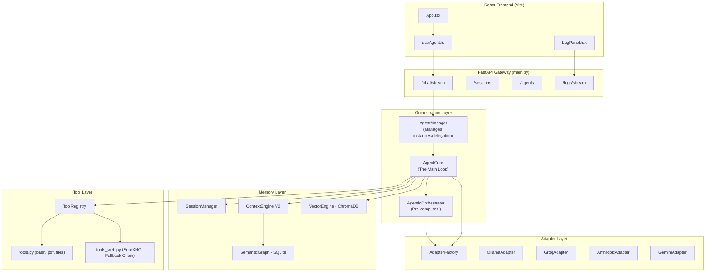

# Agent Platform — Deep Architecture Analysis (V11 Mother Platform)

## 1. What You Built (Intent & Execution Decoded)

Your codebase reveals a **local-first, multi-agent orchestration platform** with these core defining characteristics:

1. **Everything is a messages array** — The entire intelligence of the system lives in how the `messages[]` prompt is assembled each turn by the `ContextEngine` and `VectorEngine`.
2. **Pre-computation Planning (Agentic Orchestrator)** — Before the main LLM processes a turn, a smaller, faster model generates a `<plan>` block detailing strategy and required tools. This reduces main-model hallucination and improves tool utilization.
3. **Hierarchical Agent Delegation** — A parent "Mother Agent" can securely spin up child sessions using `delegate_to_agent`. Child agents execute scoped tools and return summarized answers back to the parent natively.
4. **Three-tier Memory Architecture** —
   - **Sliding Window:** Raw recent messages (via `SessionManager`) with middle-drop truncation.
   - **Convergent Graph (V2):** Goal-driven context modules and temporal facts (via `ContextEngineV2` + `SemanticGraph`).
   - **Vector RAG:** Keyed semantic anchors stored in `ChromaDB` restricted to session-specific namespaces.
5. **Text-mode tool calling** — Instead of relying solely on native LLM APIs, you parse JSON from the model's text output using a custom brace-counting scanner. This allows ANY model (local Ollama, remote Groq) to use tools reliably.
6. **Dynamic Adapter Propagation** — The system supports hot-swapping between providers. `AgentCore` implements tiered cloud-to-local failover (e.g. Groq ➔ Ollama) to ensure session continuity.

---

## 2. Architecture Diagram

---

## 3. The Agent Loop & Data Flow (V11)

### 🎯 Scenario: Mother Agent Delegates to Coder Agent

1. **User Request**: User asks "Write a bash script to print hello world".
2. **Mother Agent Inference (`AgentCore`)**:
   - `AgentCore` checks RAG (`VectorEngine`) and Session (`SessionManager`).
   - `AgenticOrchestrator.plan()` runs with a fast model to map out that the `delegate_to_agent` tool is needed.
   - Mother Agent streams generation, emitting `{"tool": "delegate_to_agent", "arguments": {"target_agent_id": "coder", "task": "..."}}`.
3. **Delegation Execution (`AgentManager.run_agent_task`)**:
   - `AgentManager` catches the tool trigger.
   - It instantiates a NEW `Session` with `parent_id` linked to the Mother Agent. The ID is prefixed with `delegated_<uuid>`.
   - It fetches the `coder` profile from `ProfileManager` (which includes limited tools like `bash`, `file_create`).
   - The recursive `AgentCore` loop begins for the bounded Coder agent.
4. **Coder Agent Loop**:
   - Emits a tool call for `bash`.
   - `ToolRegistry` executes `_bash()` in the isolated `SANDBOX_DIR`.
   - Tool result is injected. Coder agent generates final string: "I have successfully written the script."
5. **Return to Mother**:
   - The delegation tool resolves with the Coder's final string.
   - Mother Agent reads the tool result and streams the final user-facing response.
   - `ContextEngine` compresses the exchange if it's deemed non-trivial.

---

## 4. Solid Design Patterns (What Works Well)

- **ToolRegistry Brace-Counting Scanner**: Outstanding fallback wrapper that safely parses nested JSON out of raw model text when native tool usage fails or isn't supported by the model provider.
- **SSE Streaming Architecture**: The backend emits structured SSE events (`token`, `tool_call`, `plan`, `context_updated`). The `useAgent.ts` hook robustly caches and controls this stream avoiding UI blocking.
- **Dynamic System Prompt Assembly**: `_build_messages()` strictly enforces the correct token layout: System Personality -> Session Anchor -> RAG Facts -> Compressed Bullet Memory -> Tool JSON Schemas.
- **Test Coverage & Guards**: Built-in Solvability Guards trigger "Hard Pivots" if a tool fails 3 times, escaping infinite loop traps.

---

## 5. Identified System Limitations & Edge Cases

While V11 is highly functional, some scenarios observed in the implementation require monitoring:

| Issue / Scenario | Description | Impact Level |
|------------------|-------------|--------------|
| **JSON Flashing UI** | Before `retract_last_tokens` is fired, the raw JSON of a tool invocation briefly cascades down the UI SSE stream. | 🟢 Low (Cosmetic) |
| **Concurrency Lock**| Because `AgentCore` leverages a strict `asyncio.Lock()` around the session, hanging tools (e.g., massive PDF parsing or infinite bash loops) will deadlock the session entirely. | 🟡 Medium |
| **Edge Context**| Very long tool results may hit token budget limits, triggering "Middle-Drop" truncation which can occasionally hide relevant data from the LLM. | 🟡 Medium |
